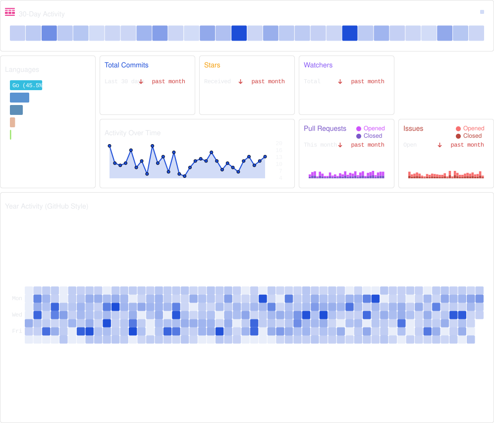

---

## Open Source SCK Repos

### SCK Stack

- [SCKelemen/cli](https://github.com/SCKelemen/cli)
- [SCKelemen/clix](https://github.com/SCKelemen/clix)
- [SCKelemen/color](https://github.com/SCKelemen/color)
- [SCKelemen/layout](https://github.com/SCKelemen/layout)
- [SCKelemen/svg](https://github.com/SCKelemen/svg)
- [SCKelemen/text](https://github.com/SCKelemen/text)
- [SCKelemen/tui](https://github.com/SCKelemen/tui)
- [SCKelemen/unicode](https://github.com/SCKelemen/unicode)
- [SCKelemen/units](https://github.com/SCKelemen/units)

### Libraries

- [SCKelemen/dataviz](https://github.com/SCKelemen/dataviz)
- [SCKelemen/design-system](https://github.com/SCKelemen/design-system)
- [SCKelemen/lsp](https://github.com/SCKelemen/lsp)

### MCPs

- [SCKelemen/ldap-mcp](https://github.com/SCKelemen/ldap-mcp)
